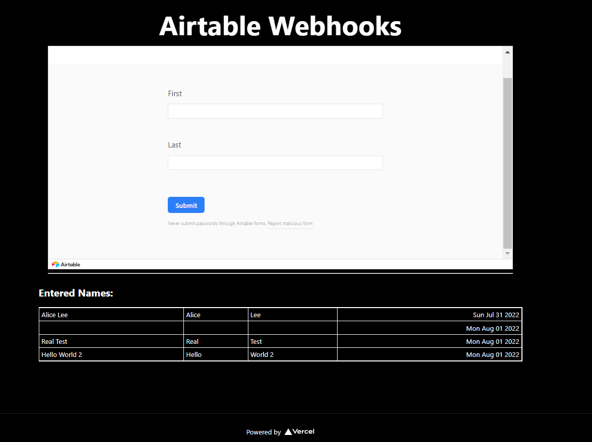
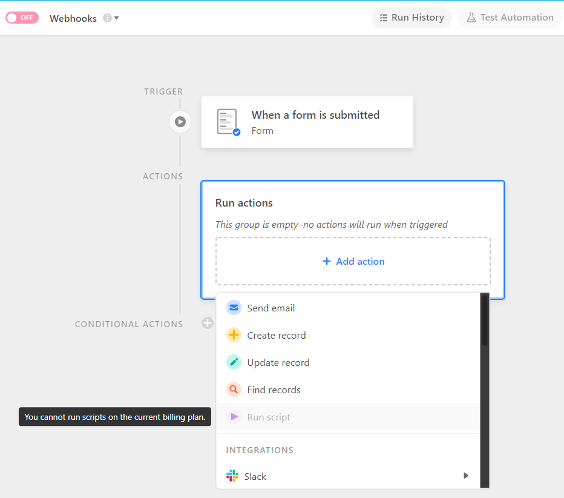
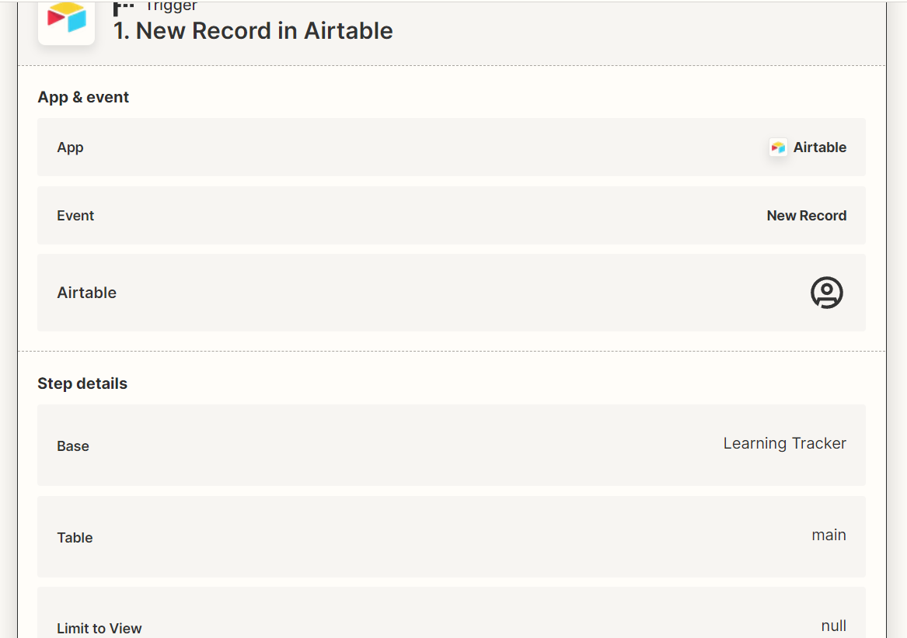
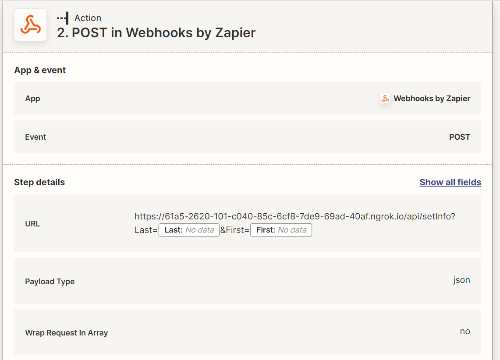

# Airtable Webhooks

Learning Webhooks from Airtable

Prisma Docs @ [prisma.io/docs/getting-started/quickstart](https://www.prisma.io/docs/getting-started/quickstart)

## Notes

These automations can be done on Airtable itself by creating a custom run script to post request but it requires premium

OR

I am using [Zapier](https://zapier.com/) to automate the process by running a webhook post on new record (there are latency issues so not real time)

## Testing

I am using ngrok to mock a public endpoint to accept requests. This will forward requests locally. The command is `ngrok.exe http 3000` on windows. I'm not sure if this works on Unix since the binary might be different
